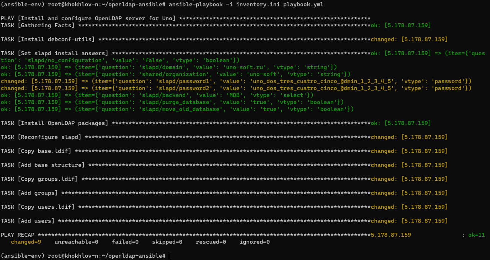
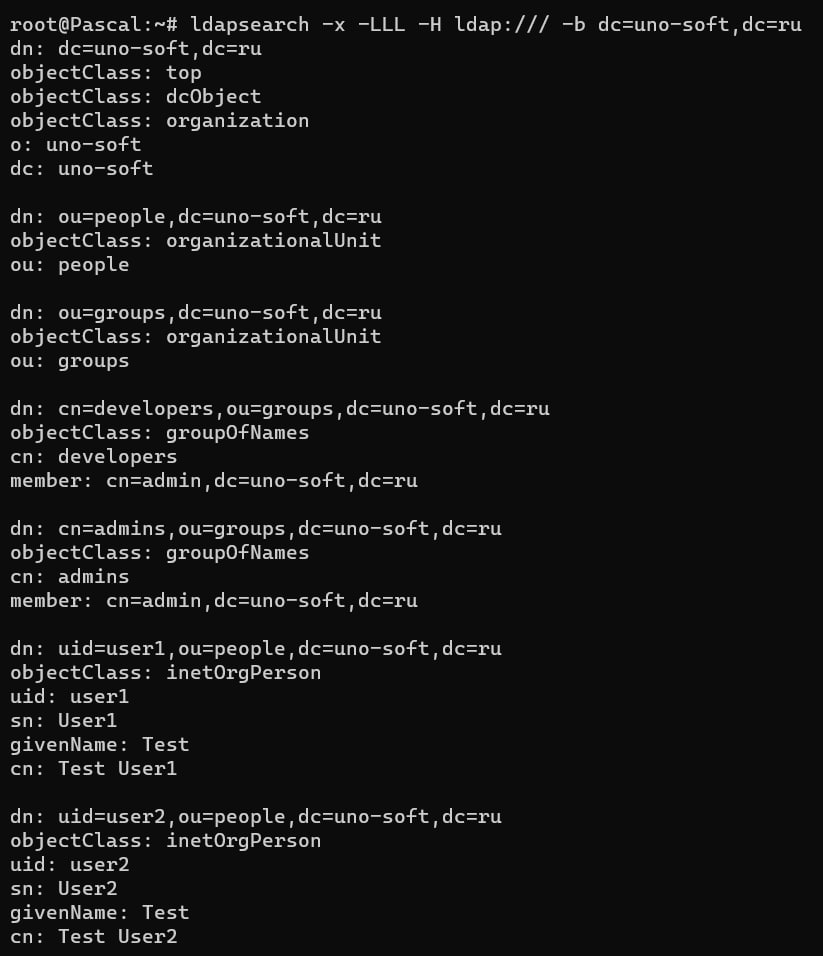

Тестовое задание

## Задачи: 

написать ansible скрипт реализующий следующее:
```
на ОС ubuntu LTS установить openldap сервер
установить в ldap пароль администратора
установить в ldap domain и organization
добавить 2 пользователя в ldap
добавить 2 группы в ldap
В ридми добавьте описание, все команды необходимые для запуска и скриншот результата.
```

## Описание выполненных задач: 

Был написан Ansible playbook, что автоматически устанавливает и настраивает OpenLDAP сервер на Ubuntu LTS.

Проект выполняет следующие задачи:
- Устанавливает OpenLDAP сервер (slapd) и утилиты (ldap-utils)
- Настраивает домен: uno-soft.ru
- Настраивает организацию: uno-soft
- Устанавливает пароль администратора LDAP
- Создает базовую структуру директорий (people и groups)
- Добавляет 2 пользователя: user1 и user2
- Добавляет 2 группы: developers и admins

## Структура проекта
```
inventory.ini       # Файл инвентаря с хостами
playbook.yml        # Основной Ansible playbook
vars.yml            # Переменные (домен, организация, пароль)
  files ->
    base.ldif       # Базовая структура LDAP
    groups.ldif     # Группы
    users.ldif      # Пользователи
      ---
README.md       # Этот файл
```
## Требования

- Ansible установлен на локальной машине
- Ubuntu LTS на целевом сервере
- SSH доступ к серверу
- Права sudo на сервере

## Установка Ansible

### Вариант 1: С использованием виртуального окружения

```bash
# Создать виртуальное окружение
python3 -m venv venv

# Активировать виртуальное окружение
# Для Линукс или мака:
source venv/bin/activate
# Для Windows:
venv\Scripts\activate

# Установить Ansible
pip install ansible
```

### Вариант 2: Обычная установка

```bash
pip install ansible
```

### Проверка установки

```bash
ansible --version
```

## Настройка

1. Отредактируйте `inventory.ini` и укажите IP адрес нужного сервера:
```ini
[ldap]
ваш_сервер_ip ansible_user=ваш_пользователь ansible_become=true ansible_python_interpreter=/usr/bin/python3
```

2. При необходимости отредактируйте `vars.yml` для изменения домена, организации или пароля администратора.

## Запуск

### Проверка подключения к серверу
```bash
ansible -i inventory.ini ldap -m ping
```

### Запуск playbook
```bash
ansible-playbook -i inventory.ini playbook.yml
```

### Если требуется ввести пароль для SSH
```bash
ansible-playbook -i inventory.ini playbook.yml --ask-pass
```

### Если требуется ввести пароль для sudo
```bash
ansible-playbook -i inventory.ini playbook.yml --ask-become-pass
```

## Проверка результата

После успешного выполнения playbook можно проверить работу LDAP:

### Проверка структуры LDAP
```bash
ldapsearch -x -H ldap://localhost -b "dc=uno-soft,dc=ru"
```

### Проверка пользователей
```bash
ldapsearch -x -H ldap://localhost -b "ou=people,dc=uno-soft,dc=ru"
```

### Проверка групп
```bash
ldapsearch -x -H ldap://localhost -b "ou=groups,dc=uno-soft,dc=ru"
```

### Авторизация от имени администратора
```bash
ldapsearch -x -D "cn=admin,dc=uno-soft,dc=ru" -W -b "dc=uno-soft,dc=ru"
```

## Данные для входа

- Домен: `uno-soft.ru`
- Base DN: `dc=uno-soft,dc=ru`
- Admin DN: `cn=admin,dc=uno-soft,dc=ru`
- Пароль администратора: указан в `vars.yml`

## Созданные пользователи

- user1 (uid=user1, cn=Test User1)
- user2 (uid=user2, cn=Test User2)

Пароль для обоих: password123

## Созданные группы

- developers
- admins

## Скриншоты

Скриншоты успешного выполнения находятся в файлах:
- `local_.jpg` - запуск с локальной машины
- `server_.jpg` - результат на сервере





## Устранение проблем

Если возникают ошибки при добавлении данных в LDAP (например, запись уже существует), playbook продолжит выполнение благодаря `ignore_errors: true`. При повторном запуске это нормально.

Для полной переустановки можно удалить LDAP и запустить playbook заново:
```bash
sudo apt-get purge slapd ldap-utils -y
sudo rm -rf /var/lib/ldap /etc/ldap
```
